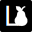

#  library-peer

A badge for **NPM peer dependencies**.


## The badge

[](https://github.com/Lcfvs/library-peer#readme)


## Have you seen that badge on a dependency you have to install?

### Common library users

You're a website/app/... developer? This badge doesn't have any special meaning for you, except that module may act as a singleton.

Just install it as suggested on the related module.


### Library authors/maintainers

This badge presence on a dependency you're using means that module generally should be installed as a [**peer dependency**](https://nodejs.org/uk/blog/npm/peer-dependencies/) to use **the same instances** (classes, prototypes, symbols, ...).

Install the related module by `npm i --save-peer package-name`


## NPM peer dependency authors/maintainers

Just link it to your markdown

```md
[](https://github.com/Lcfvs/library-peer#readme)
```

## License

MIT
